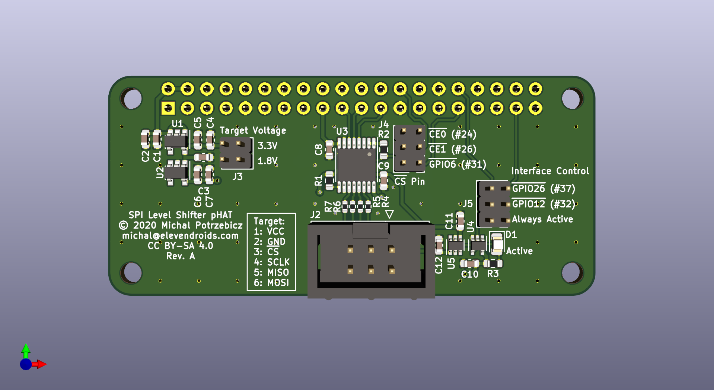
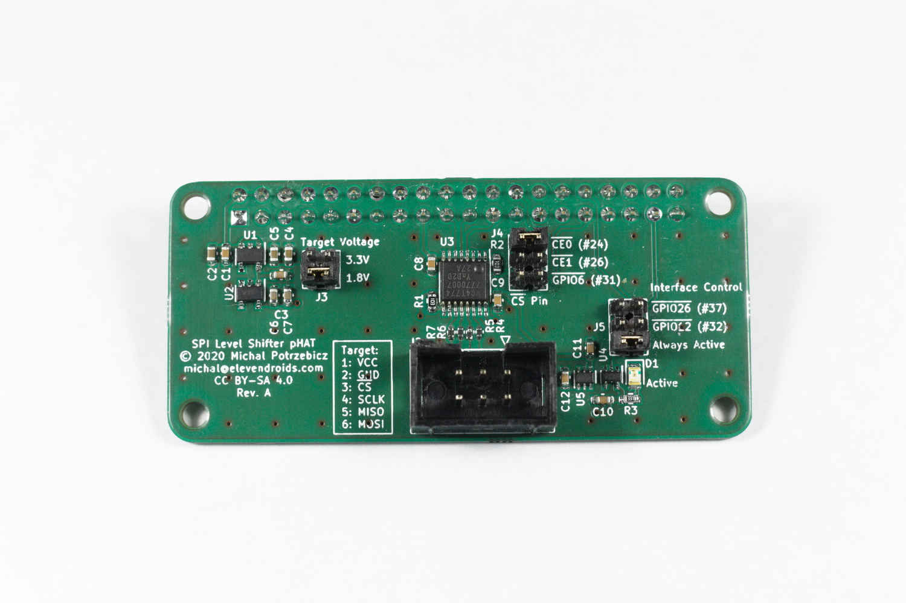

# SPI Level Shifter pHAT

An expansion board for Raspberry Pi Zero / 2 / 3 / 4 and other pin-compatible SBCs.

Provides a configurable SPI interface with a level shifter to communicate with 3.3V and 1.8V logic level devices.

In addition, this board can also be used as a SPI NOR Flash in-system programmer - target power supply and interface can be controlled in software to avoid interference with a running system.

# Features

- independent 3.3V and 1.8V power supplies, target voltage selectable by a jumper
- high speed logic level translator - rated up to 380Mbit/s (Note that the actual max. speed is limited by the SBC's capabilities, length and quality of the connection cable to the target and the target itself)
- support for powered-off operation - the interface stays isolated while either the SBC is powered off or the interface is disabled by software
- configurable interface control: the translator and target power supply may be disabled by either one of two different GPIO pins or may be enabled permanently
- selectable /CS pin source: SPI0 /CE0, SPI0 /CE1 or GPIO6 (on RPi)
- 6-pin IDC target connector, pin-compatible with the standard 8-pin ISP connector for SPI NOR Flash memories

Designed in KiCad 5.1.7

PCB render:

Prototype PCB:

Schematic: [PDF](docs/spi-level-shifter-phat.pdf)

License: [CC BY-SA 4.0](https://creativecommons.org/licenses/by-sa/4.0/)
